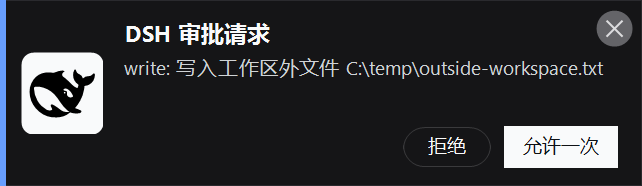

# dsh-tu4-notification

> A [DeepSeek Harness (DSH)](https://github.com/deepseek-ai/deepseek-harness) plugin that pings you on Windows the instant an agent operation awaits approval.
>
> DSH（DeepSeek Harness）插件：agent 操作需要审批的瞬间，在 Windows 上弹出带 DSH 黑鲸鱼 logo 的深色通知卡片。
>
> 📦 [github.com/zehenk/dsh-tu4-notification](https://github.com/zehenk/dsh-tu4-notification) ｜ [Issues](https://github.com/zehenk/dsh-tu4-notification/issues) ｜ [Changelog](CHANGELOG.md) ｜ [MIT](LICENSE)

When any agent operation requires approval (sandbox escalation, file access, …), DSH parks the request **pending** until you answer it in the Web GUI. If you've switched to another app, you miss it. This plugin fires a native Windows toast the moment the approval becomes pending, so you can glance back at DSH and approve or deny.

当任何 agent 操作需要审批（沙箱权限提升、文件访问等），DSH 会把请求挂起（**pending**），等你在 Web GUI 里应答。如果你切到了别的软件，就会错过。本插件在审批进入 pending 的瞬间弹出 Windows 原生 toast，让你一眼就能回到 DSH 处理审批。

## Preview / 预览



Dark card, bottom-right of the primary monitor: brand-blue accent bar, white rounded-square plate with the official **DSH black whale** logo, title + truncated body. Plays a sound, fades out after 10 s, **never steals focus**.

深色卡片，主屏右下角：品牌蓝强调条、白底圆角方块内嵌官方 **DSH 黑鲸鱼** logo、标题 + 截断正文。带提示音，10 秒后淡出，**绝不抢焦点**。

## Features / 特性

- **Dark toast card** matching the DSH dark theme (`#151517` + brand-blue `#679EFE` accent), rendered with WinForms — no third-party dependencies
- **DSH black whale logo** drawn as vector graphics (official SVG path embedded in the script — crisp at any DPI, no image file)
- **Sound** on show (`SystemSounds.Exclamation`)
- **No focus steal** (double-protected: `WS_EX_NOACTIVATE` + foreground-window restore)
- **Auto-dismiss** after 10 s with an 800 ms fade
- **DPI-aware** (crisp at 200%+)
- **`msg.exe` fallback** if the WinForms path fails — the notification never silently dies
- **Zero interference**: never blocks or alters the approval flow; failures are logged and swallowed

- **深色 toast 卡片**，匹配 DSH 暗色主题（`#151517` + 品牌蓝 `#679EFE` 强调条），WinForms 自绘——零第三方依赖
- **DSH 黑鲸鱼 logo** 以矢量绘制（官方 SVG path 内嵌在脚本里——任意 DPI 清晰，无需图片文件）
- **提示音**（`SystemSounds.Exclamation`）
- **不抢焦点**（双保险：`WS_EX_NOACTIVATE` + 前台窗口恢复）
- **10 秒自动消失**，0.8 秒淡出
- **DPI 感知**（200%+ 依然清晰）
- **`msg.exe` 回退**：WinForms 路径失败时自动退回，通知永不静默失效
- **零干扰**：绝不阻塞或改变审批流程；失败只记日志、不抛出

## Requirements / 环境要求

| Item / 项目 | Requirement / 要求 |
|---|---|
| OS / 系统 | Windows 10 / 11 (non-Windows: terminal log only / 非 Windows 仅输出终端日志) |
| PowerShell | 5.1+ (built into Windows / Windows 自带) |
| DSH | A build with plugin support (`dsh plugin` available) / 支持插件的 DSH 版本 |
| Node.js | >= 18 (host runtime / 宿主运行时) |
| Session | DSH must run as the interactive user for the card to appear / DSH 须以当前交互用户身份运行 |

## Installation / 安装

```powershell
# From the packed tarball / 从 tarball 安装
dsh plugin --profile web add .\dsh-tu4-notification-0.3.0.tgz

# Or from this directory / 或从本目录
dsh plugin --profile web add .\
```

Then **restart DSH** — host plugins load at startup only, there is no hot reload.
安装后**重启 DSH**——宿主插件仅在启动时加载，无热加载。

> **Note / 注意:** if you previously installed the pre-rename `dsh-approval-notify`, remove it first so both don't fire at once:
> 如果你之前装过改名前的 `dsh-approval-notify`，先卸载它，避免两个插件同时弹通知：
> ```powershell
> dsh plugin --profile web remove dsh-approval-notify
> ```

### Uninstall / 卸载

```powershell
dsh plugin --profile web remove dsh-tu4-notification
```

Then restart DSH. 然后重启 DSH。

## How it works / 工作原理

DSH dispatches an `approval/request` **waterfall** when an operation needs approval. This plugin registers a listener at the **head** of that chain (`prepend: true` — required, because the host answerer returns a blocking Promise and never calls `next()`):

```
approval/request
  → dsh-tu4-notification (prepend): send toast → next()
  → host answerer (Web GUI): pending entry, wait for user
  → user approves / denies
```

The notification is fire-and-forget: spawned asynchronously, errors logged and swallowed, `next()`'s result passed through untouched. Full details: [docs/plugin-mechanism.md](docs/plugin-mechanism.md).

DSH 在操作需要审批时派发 `approval/request` **waterfall 事件**。本插件注册在该链条**链头**（`prepend: true`——必需，因为宿主 answerer 返回阻塞 Promise 且从不调用 `next()`）。通知是 fire-and-forget：异步 spawn、错误只记日志、`next()` 返回值原样透传。详见 [docs/plugin-mechanism.md](docs/plugin-mechanism.md)。

## Notification content / 通知内容

- **Card / 卡片:** title `DSH 审批请求` + body `<tool>: <reason>` (e.g. `write: escalate sandbox to danger-full-access: …`), body truncated to 2 lines
- **Sound / 提示音:** `SystemSounds.Exclamation`
- **Terminal log / 终端日志:** `[dsh-tu4-notification] DSH 审批请求 — <tool>: <reason>` (visible in the DSH startup terminal)

## Approval policy note / 审批策略说明

If a session's approval policy is `never`, DSH refuses without dispatching the event — no pending entry in the GUI and **no notification** (by design). With policy `ask`, every pending approval fires a notification.

会话审批策略为 `never` 时，DSH 直接拒绝、不派发事件——GUI 无 pending 条目，**也不发通知**（设计如此）。策略为 `ask` 时，每次审批 pending 都会触发通知。

## Development / 开发

```powershell
# Smoke test (asserts module contract, pure-ASCII notify.ps1, prepend, error isolation)
node smoke-test.mjs

# Pack
pnpm pack   # → dsh-tu4-notification-0.3.0.tgz
```

**Hard constraint / 硬性约束:** `notify.ps1` must stay **pure ASCII** — PowerShell 5.1 reads BOM-less `.ps1` as ANSI (GBK on zh-CN) and any non-ASCII byte mojibakes. All display text arrives via command-line parameters, never as file content. See [docs/windows-gotchas.md](docs/windows-gotchas.md) for the full list of Windows/PowerShell pitfalls.

**硬性约束：** `notify.ps1` 必须保持**纯 ASCII**——PowerShell 5.1 把无 BOM 的 `.ps1` 按 ANSI（zh-CN 即 GBK）读取，任何非 ASCII 字节都会乱码。所有展示文本走命令行参数传入，绝不写入文件。完整的 Windows/PowerShell 踩坑清单见 [docs/windows-gotchas.md](docs/windows-gotchas.md)。

### Preview without a real approval / 无需真实审批的预览

`notify.ps1` supports `-PreviewOut <png>`: it renders the card to a PNG and exits (no sound, no timer) — used for the README preview and visual self-checks.

`notify.ps1` 支持 `-PreviewOut <png>`：把卡片渲染成 PNG 后退出（无提示音、无计时器）——用于 README 预览与视觉自检。

```powershell
powershell -NoProfile -File .\notify.ps1 -Title "DSH 审批请求" -Body "write: test" -PreviewOut .\assets\card-preview.png
```

## Troubleshooting / 故障排查

- **No card, but a classic gray `msg` dialog appeared** → the WinForms path failed and the fallback kicked in. Check the DSH startup terminal for `[dsh-tu4-notification] notify.ps1 调用失败`.
- **Debug the card** → set `$env:DSH_NOTIFY_DEBUG = 1` in the DSH terminal, trigger an approval, then read `%TEMP%\dsh-tu4-notification-debug.txt`.
- **No notification at all** → check the session's approval policy (`never` suppresses by design) and that DSH runs as the interactive user.

- **没看到卡片，只看到灰色 `msg` 对话框** → WinForms 路径失败、走了回退。查 DSH 启动终端的 `[dsh-tu4-notification] notify.ps1 调用失败`。
- **调试卡片** → 在 DSH 终端设 `$env:DSH_NOTIFY_DEBUG = 1`，触发一次审批，然后读 `%TEMP%\dsh-tu4-notification-debug.txt`。
- **完全没通知** → 检查会话审批策略（`never` 按设计抑制）以及 DSH 是否以当前交互用户身份运行。

## Documentation / 文档

- [docs/design.md](docs/design.md) — card visual spec, whale logo, no-focus-steal, DPI
- [docs/plugin-mechanism.md](docs/plugin-mechanism.md) — DSH plugin contract, `prepend` requirement, event timing
- [docs/windows-gotchas.md](docs/windows-gotchas.md) — Windows / PowerShell 5.1 pitfalls

## License / 许可证

[MIT](LICENSE)
